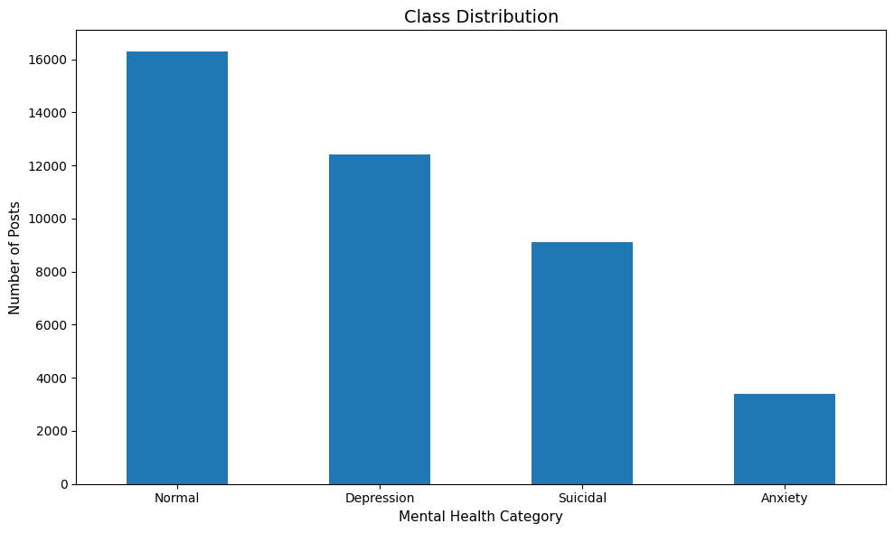
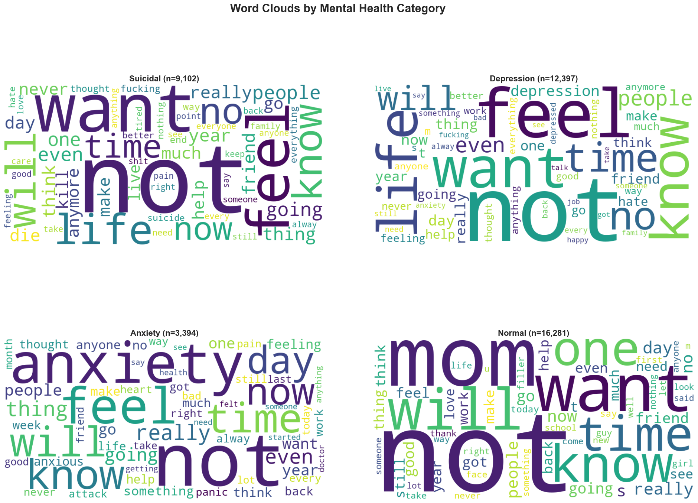
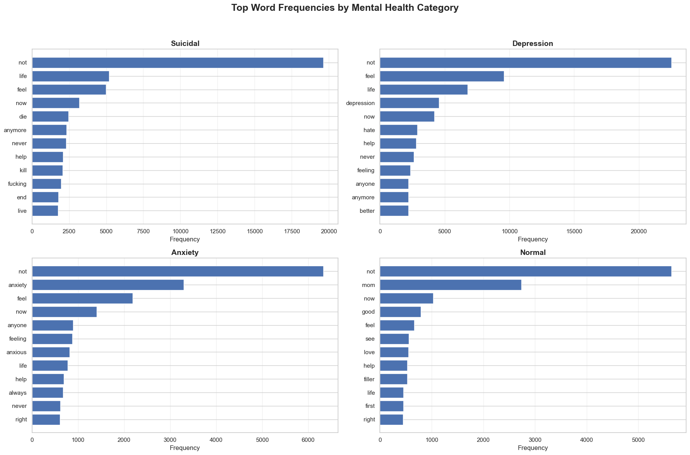
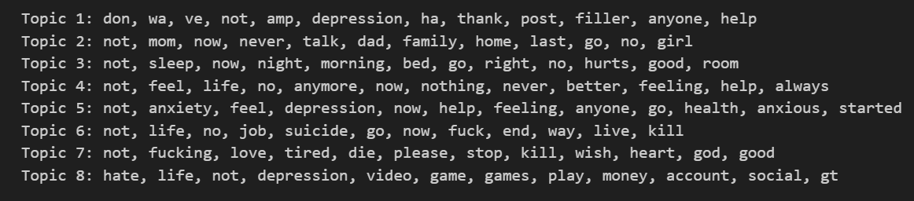
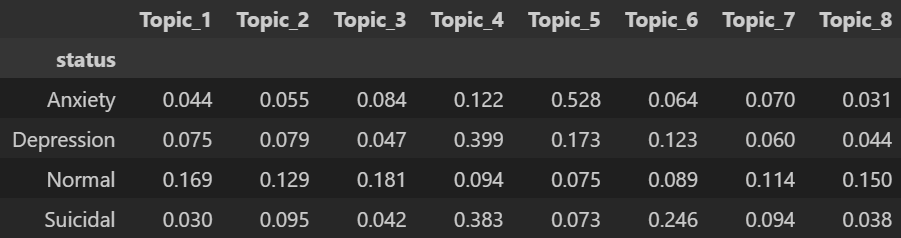
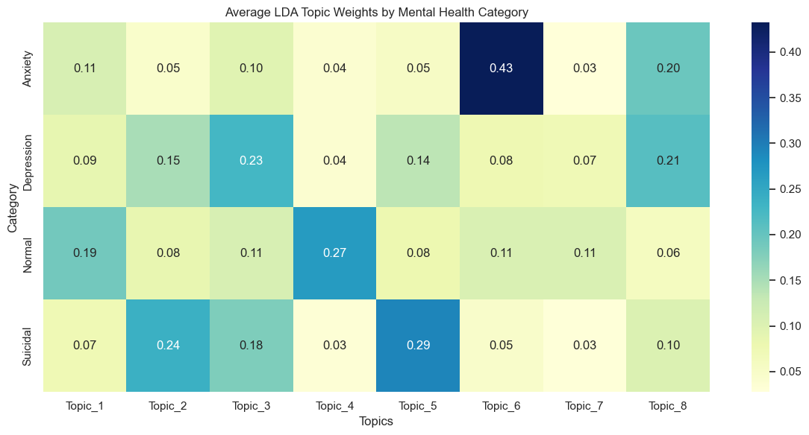
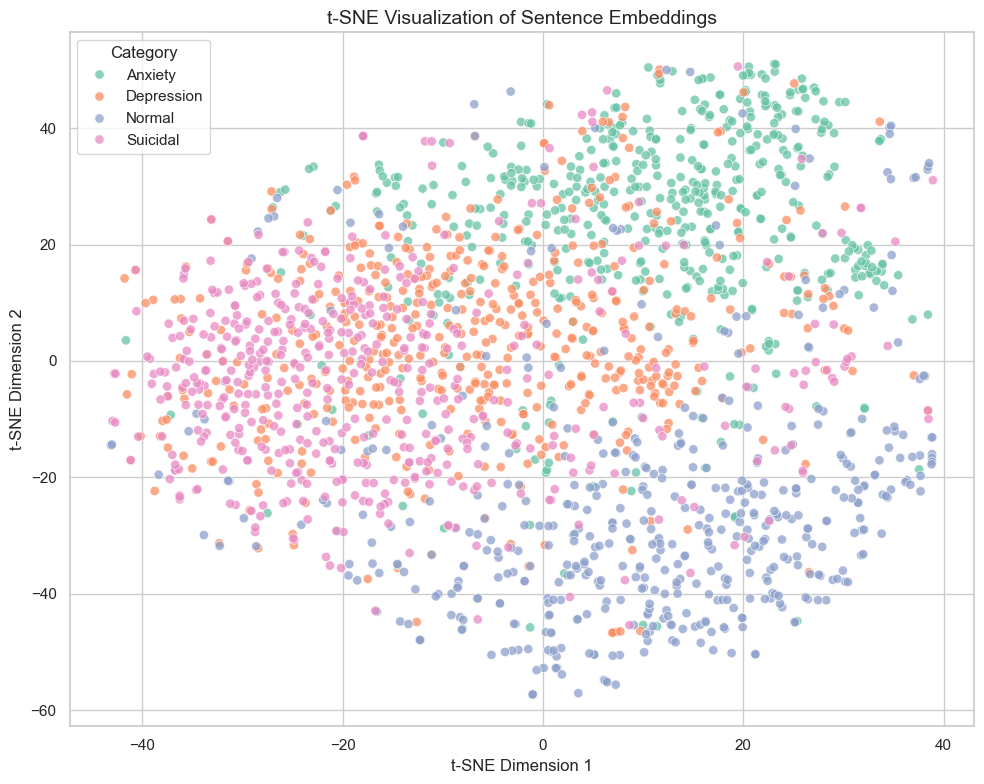
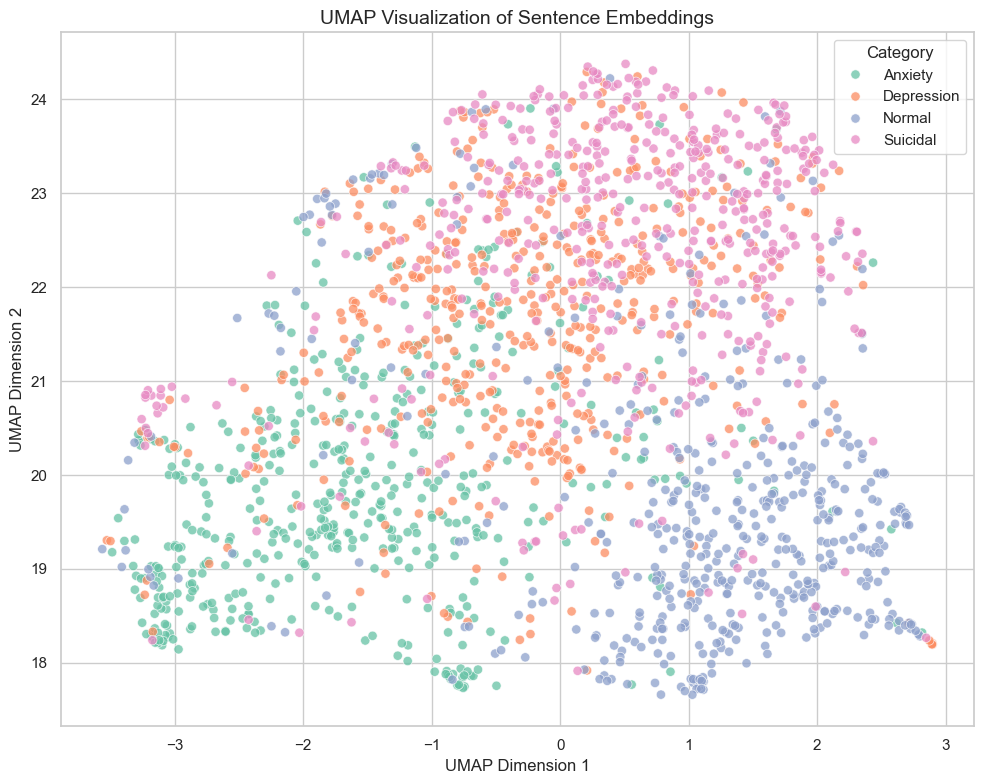

# Classification Knowledge Library
---

## Table of Contents

1. [Executive Summary](#executive-summary)
2. [Problem Definition](#problem-definition)
3. [Exploratory Data Analysis](#exploratory-data-analysis)
4. [Text Preprocessing and Feature Selection](#text-preprocessing-and-feature-selection)
5. [Model Development](#modeling-development)
6. [Model Evaluation](#model-evaluation)
7. [Performance Summary](#performance-summary)
8. [Suicide Risk Detection Framework](#suicide-risk-detection-framework)
9. [Limitations and Future Work](#limitations-and-future-work)
10. [How It Can Be Used](#how-it-can-be-used)
11. [References](#references)

---

## Executive Summary

This project employs machine learning models to classify online text posts into four mental health categories: **Suicidal, Depression, Anxiety, and Normal**. The dataset contains 41,174 labeled training posts and 8,436 unlabeled test posts. Using statistical methods and machine learning algorithms, the text data is transformed into numerical representations that allow supervised learning models to detect linguistic patterns associated with different mental health categories. Model performance is evaluated using classification metrics such as precision, recall, and F1 score, with particular attnetion to correctly identifying high-risk categories such as Suicidal posts.

---

## Problem Definition

**Objective**: Given a text post x, predict its mental health category y &isin; {Suicidal, Depression, Anxiety, Normal}

**Research Question**: How effectively can supervised machine learning models detect linguistic patterns associated with suicidal ideation, depression, anxiety, and normal expression in online text posts, and to what extent can these predictions support the identification of high-risk content for early intervention by mental health support services?

**Motivation**: Mental health signals often appear in online text communication. Automated text classification can assist in identifying patterns associated with psychological distress and may support research in mental health monitoring.

**Important Disclaimer**: The dataset labels represent forum based annotations rather than clinical diagnoses. Therefore, the model learns linguistic patterns associated with mental health conditions rather than diagnosing medical conditions. Predictions should be interpreted as text classification outputs rather than clinical assessments.

---

## Exploratory Data Analysis
### 1. Data Overview

| File | Description |
|----------|---------------------|
| **train.csv** | Labeled dataset used for model training |
| **test.csv** | Unlabeled dataset used for model prediction |

Each record contains:
| Column | Description |
|----------|----------------|
| *id* | Unique identifier for the post |
| *text* | Raw text content of the post |
| *status* | Mental health label (training set only) |

The labels are:
| Class | Description |
|----------|----------------|
| **Suicidal** | Posts expressing suicidal thoughts |
| **Depression** | Posts describing depressive symptoms |
| **Anxiety** | Posts expressing worry or panic |
| **Normal** | Posts not related to mental health distress |

The data consists of two parts:
- **Training set**: 41,174 labeled posts
- **Test set**: 8,436 posts for prediction
  

### 2. Class Distribution

| Class | Label Count | Percentage |
|----------|---------|--------|
| Suicidal | 9,102 | 22.1% |
| Depression | 12,397 | 30.1% |
| Anxiety | 3,394 | 8.2% |
| Normal | 16,281 | 39.5% |

The dataset shows *class imbalance*, with Anxiety class being the smallest category.

  

### 3. Word Clouds

  

### 4. Word Frequency Chart

  

Prominenet words include per category:
- **Suicidal posts**: *die, never, kill, fuck*
- **Depression posts**: *depression, feel, hate, anyone, better*
- **Anxiety posts**: *anxiety, anxious, always, right*
- **Normal posts**: *mom, now, school, love, first*

Word clouds and word frequency chart were generated for each mental health category to visualize frequently occurring words in the dataset. Suicidal posts prominently contain terms related to death and distress, while depression and anxiety posts emphasize emotional and cognitive expressions such as “hate” and “anxious.” In contrast, normal posts tend to include more neutral everyday topics such as mom and school. These observations suggest that linguistic differences exist across categories, supporting the feasibility of using text-based machine learning methods for classification.

### 5. Latent Dirichlet Allocation (LDA) Topic Modeling
**Topic Interpretation**

  

LDA was applied to discover latent linguistic themes within the dataset without using the provided labels. Each topic represents a group of words that frequently co-occur across posts. The top words of each topic help interpret the underlying themes of discussion in the dataset. Several topics correspond to recognizable mental-health related patterns. For example, Topic 5 contains words such as anxiety, feel, anxious, depression, and help, which reflect emotional distress and anxiety-related expressions. Topic 4 includes words such as life, nothing, feel, and anymore, suggesting themes of hopelessness or negative emotional states often associated with depression. Topic 6 contains words such as suicide, kill, end, and life, indicating explicit suicidal ideation language. These topics demonstrate that the dataset contains multiple distinct linguistic patterns related to emotional distress, suicidal ideation, and everyday discussion.

**Average Topic Distribution across Mental Health Categories**

  

To understand how these latent topics relate to the labeled categories, we computed the average topic proportion for each mental health class. Since LDA represents each document as a mixture of topics, the average topic weights indicate which topics are most prevalent within each category.

**Distribution in Heatmap**

  

- **Anxiety** posts are strongly associated with Topic 5 (0.53), which contains words related to anxiety symptoms and emotional distress.
- **Depression** posts are primarily associated with Topic 4 (0.40), which reflects language of hopelessness and negative emotional states.
- **Suicidal** posts show strong contributions from Topic 4 (0.38) and Topic 6 (0.25), suggesting a combination of depressive language and explicit references to suicide.
- **Normal** posts show a more balanced distribution across topics, indicating more general conversational language rather than a dominant mental-health theme.

This analysis supports the hypothesis that linguistic signals related to mental health conditions are detectable within online text posts, motivating the use of machine learning models to automatically identify high-risk content.

### 6. Embedding Visualization: t-SNE and UMAP
To explore whether posts from different mental health categories exhibit distinct linguistic patterns, we visualized sentence embeddings using dimensionality reduction techniques. 

  
  

Both t-SNE and UMAP were applied to project high-dimensional sentence embeddings into two dimensions. The resulting plots show that posts labeled as Normal form a distinct cluster separated from mental health–related categories. Anxiety posts also exhibit a relatively cohesive cluster, while Depression and Suicidal posts show partial overlap, reflecting similarities in emotional language between these conditions. The consistent patterns observed across both t-SNE and UMAP agree to suggest that the embedding representations capture meaningful semantic differences between mental health categories.

---

## Text Preprocessing and Feature Selection
### Preprocessing Steps
Unlike traditional NLP pipelines, punctuation and numbers were partially preserved because they can carry emotional meaning in social media text (i.e., “!!!”, “day 1”, “why??”).
- Lowercasing
- Contraction expansion
- URL removal
- Mention removal
- Hashtag normalization
- Repeated character normalization
- Punctuation preservation for emotional signals  

### Feature Representation
1. **TF-IDF**: Term Frequency–Inverse Document Frequency is used as the baseline feature representation because it is a widely adopted method in classical text classification tasks. TF-IDF represents documents as weighted vectors based on the importance of words within a document relative to the entire corpus. This approach captures word frequency patterns that may distinguish different mental health categories. For example, suicidal posts may contain terms related to death or hopelessness, while anxiety-related posts may contain words associated with panic or worry. TF-IDF is computationally efficient, interpretable, and provides a strong baseline for comparison against more advanced representations.
- Library: scikit-learn

2. **Sentence Embeddings**: Sentence embeddings are used as an improved feature representation because they capture the semantic meaning of text rather than relying solely on word frequency. Transformer-based embedding models map entire sentences into dense vector representations that preserve contextual relationships between words. This allows semantically similar sentences to have similar representations even if they use different vocabulary.
For example, *"I want to disappear."* and *"I don't want to live anymore."* may be represented similarly by embeddings despite sharing few words. This property is particularly useful for mental health text classification, where emotional expressions may appear in many different forms.
- Library: SentenceTransformers
- Model: all-MiniLM-L6-v2

3. **Contextual Representation**:
- Library: Hugging Face Transformers
- Models: BERT, RoBERTa, DistilBERT

### Linguistic Feature Engineering
In addition to transformer-based sentence embeddings, we incorporated several linguistic features inspired by psychological language research. These features included first-person pronoun frequency, negative emotion word usage, absolutist terms, and message length. Prior research has shown that individuals experiencing suicidal ideation often exhibit distinctive linguistic patterns, such as increased self-referential language and absolutist thinking. Combining semantic embeddings with these linguistic features improved the model’s ability to detect suicide-related language.
- Pronoun usage
- Negative emotion words
- Absolutist language
- Sentence length
- Punctuation patterns

---

## Model Development

We first establish a baseline using TF-IDF features with logistic regression, a widely used benchmark in text classification. We then evaluate more expressive representations using transformer-based sentence embeddings combined with classical machine learning models such as SVM and Random Forest. Finally, we explore fine-tuning a BERT model to capture deeper contextual relationships in the text.

Since we have seen the dataset contains uneven class distributions in data exploration section, with fewer examples of suicidal posts compared to other categories, class imbalance handling is applied during model training. We use class weighting to assign higher importance to minority classes so that the classifier does not become biased toward predicting the majority class. This helps improve the model’s ability to correctly identify posts associated with suicidal ideation.

### 1. Multi-class Classification Models

| Level | Model | Features |
|----------|----------------|-------------|
| **Baseline** | Multinomial Logistic Regression | TF-IDF |
| **Model Improvement** | Support Vector Machines (SVM) | TF-IDF |
| **Feature Improvement** | Multinomial Logistic Regression | Sentence Embeddings |
| **Combined** | SVM | Sentence Embeddings |
| **Advanced** | BERT | raw text |
| **Optional** | Random Forest / kNN | Sentence Embeddings |

- **Baseline**: Logistic regression with TF-IDF is selected as the baseline because it is a standard benchmark in text classification. The linear nature of logistic regression works well with high-dimensional sparse features such as TF-IDF vectors. This model provides an interpretable starting point and allows us to evaluate whether more complex representations offer meaningful improvements.
- **Model Improvement**: To evaluate whether a stronger classifier improves performance while keeping the feature representation fixed, we replace logistic regression with a Support Vector Machine (SVM) using the same TF-IDF features. SVMs are widely used in text classification because they are effective in high-dimensional spaces and can learn more flexible decision boundaries than logistic regression. By holding the TF-IDF representation constant, this experiment isolates the effect of changing the classifier.
- **Feature Improvement**: We examine the impact of improving the feature representation while keeping the classifier constant. Sentence embeddings generated from transformer-based models encode the semantic meaning of entire sentences into dense vector representations. Unlike TF-IDF, which only captures word frequency, embeddings capture contextual relationships and semantic similarity between sentences. For example, sentences expressing similar emotional meaning may be represented closely in embedding space even if they use different vocabulary. Applying logistic regression to sentence embeddings allows us to test whether richer semantic representations improve classification performance.
- **Combined**: After independently evaluating both classifier and feature improvements, we combine them by training an SVM using sentence embeddings. This model integrates both improvements: a stronger classifier and a more expressive feature representation. The goal is to determine whether the combination of these two factors produces better predictive performance than either improvement alone.
- **Advanced**: BERT (Bidirectional Encoder Representations from Transformers) is included as the most advanced model in the study. Unlike TF-IDF or static sentence embeddings, BERT processes raw text directly and learns contextual relationships between words through a deep transformer architecture. Fine-tuning BERT allows the model to adapt its internal representations specifically for the mental health classification task. This model represents the current state-of-the-art approach for many natural language processing tasks.
- **Optional**: Additional models such as Random Forest and k-Nearest Neighbors (kNN) are explored as optional experiments using sentence embeddings. These models are included to investigate whether nonlinear or distance-based classifiers can capture patterns within embedding space that linear classifiers may miss. However, they are not part of the main experimental progression because logistic regression and SVM are generally stronger baselines for high-dimensional text data.

### 2. Binary Classification Models (might have to drop this idea, it will interrupt with the accuracy test on kaggle and it's too extreme; we can talk about it later)
The binary classification task aims to detect suicidal risk, where posts labeled as Suicidal, Depression, or Anxiety are grouped into a single risk category and compared against Normal posts. This framing aligns with the real-world objective of identifying posts that may require mental health intervention. To systematically evaluate the effect of both feature representation and model complexity, we adopt a progressive model hierarchy. Each stage introduces a controlled improvement so that the contribution of features and classifiers can be examined separately.

| Level | Model | Features |
|----------|----------------|-------------|
| **Baseline** | Logistic Regression | TF-IDF |
| **Model Improvement** | Support Vector Machines (SVM) | TF-IDF |
| **Feature Improvement** | Logistic Regression | Sentence Embeddings |
| **Combined** | SVM | Sentence Embeddings |
| **Advanced** | BERT | raw text |
| **Optional** | Random Forest / kNN | Sentence Embeddings |

### Model Training Procedure
- Validation split
- Cross-validation
- Hyperparameter tuning using grid search
- Class weighting
  
---

## Model Evaluation

### Key Metrics
| Metric | Purpose |
|----------|----------------|
| Accruacy | Overall correctness |
| Precision | Control false positives |
| Recall | Detect true cases |
| (macro) F1 score | Balance precision and recall |
| ROC / Precision-Revall Curves | Confidence of the model in suicidal predictions |

---

## Model Interpretation
The following tools help explain why the model made a prediction:
1. **SHAP**: It explains feature contributions. Example: word *"die* increases suicial probability.
2. **LIME**: It explains individual prediction. Example: why this specific post was classified as suicidal

---

## Performance Summary

Figures, tables, justification of the best chosen model

---

## Suicide Risk Detection Framework
Application to real world of how we can actually help moderators.

---

## Limitations and Future Work
### Limitations
- Labels are not clinical diagnoses
- Dataset may contain labeling noise
- Users from online platform (i.e. Reddit) may not represent general population
- Model predictions should not be used for medical decisions

### Potential Improvements
- Transformer models
- Larger datasets
- Context-aware models
- User-level conversation modeling
- Fairness and bias analysis

---

## How It Can Be Used

### For Modeling Experts
- **Feature Engineering**: Extract linguistic signals such as word frequencies, sentiment markers, punctuation patterns, and text length as model features.
- **Model Training**: Train supervised classification models (i.e., logistic regression, SVM, or transformer-based models) to predict mental health categories from text.
- **Performance Benchmarking**: Compare alternative models using macro F1 score and per-class recall to ensure balanced performance across categories.
- **Model Interpretation**: Analyze feature importance or attention patterns to identify which linguistic signals contribute most strongly to predictions.
  
### For Platform Moderators and Safety Teams
- **Content Triage**: Flag posts predicted as Suicidal or high-risk categories for human review and moderation.
- **Early Warning Signals**: Identify posts that may indicate psychological distress and prioritize them for support interventions.
- **Moderator Assistance**: Provide automated classification scores to help moderators quickly identify potentially concerning content.
- **Escalation Workflow**: Integrate model predictions into moderation pipelines to guide manual review and support actions.
  
### For Researchers and Mental Health Analysts
- **Language Pattern Analysis**: Study how linguistic features differ across suicidal, depression, anxiety, and normal posts.
- **Large-Scale Text Analysis**: Analyze thousands of posts to identify trends in mental health discussions across online communities.
- **Trend Monitoring**: Track changes in mental health–related language patterns over time or during major societal events.
- **Behavioral Insights**: Examine how emotional tone, vocabulary, and writing style correlate with different mental health states.

### For Data Scientists and NLP Practitioners**
- **Benchmark Dataset**: Use the dataset to evaluate new NLP classification methods for emotionally sensitive text.
- **Model Comparison**: Test different architectures such as TF-IDF models, neural networks, and transformer-based models.
- **Explainability Research**: Apply interpretability methods (i.e., SHAP or attention analysis) to understand model decisions.
- **Class Imbalance Strategies**: Experiment with sampling techniques, class weighting, and threshold tuning for imbalanced datasets.
---

## References
- Kaggle. (2026). Classification of Mental Health Status Dataset. Retrieved from https://www.kaggle.com/competitions/classification-of-mental-health-status/data
- Relevant research papers
- Any tools used

---

